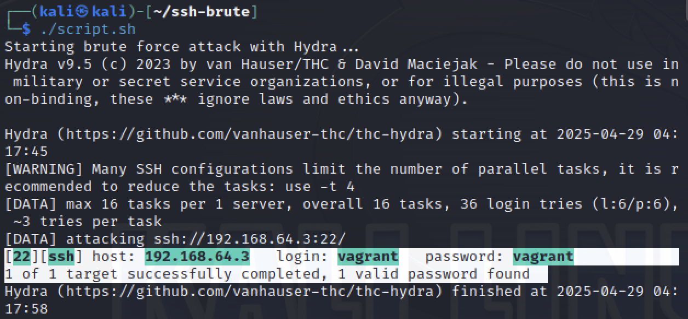
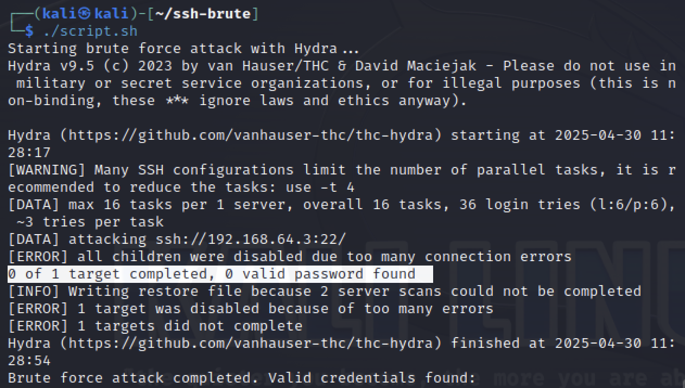
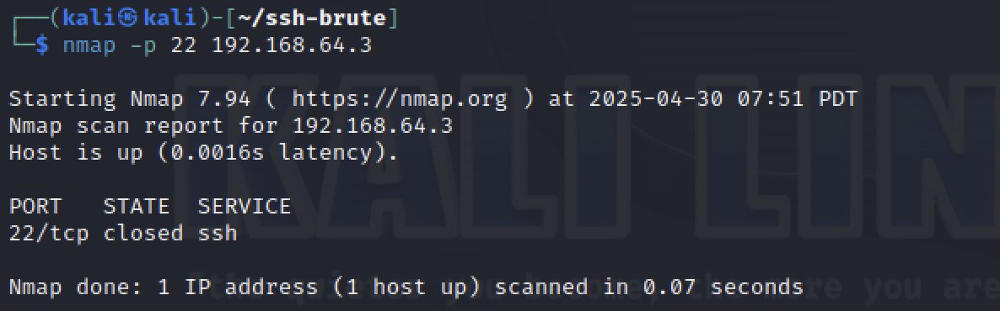
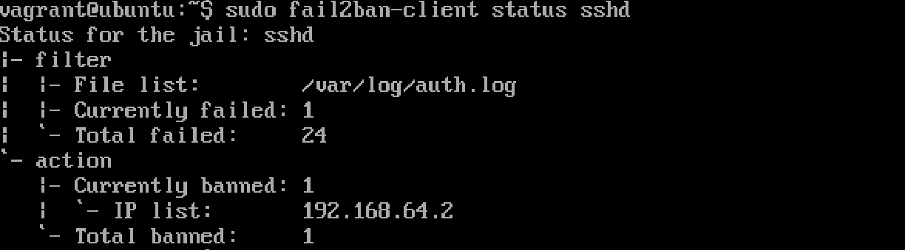

# 🔐 Phase 3: Before and After

## 🎯 Objective

In this phase, we aim to **protect the vulnerable SSH service** on the Metasploitable3 victim machine using a defensive mechanism.  
We chose **Fail2Ban** as our defense tool, which detects brute-force login attempts and bans the attacker's IP address.

---

## 🧪 Attack Demonstration (Before Defense)

This attack was previously implemented in **Phase 1**, where a brute-force SSH script was used from the Kali attacker machine to try different username/password combinations against the victim.

### 🔻 Before Applying Defense

- SSH service was exposed with **no protection**.
- Attacker successfully guessed login credentials using a brute-force script.

  run the script: 
```bash
./script.sh
```

### 🔁 After Applying Defense
- The attack was blocked after 3 failed login attempts.
- The attacker received a "connection refused" error.
- Fail2Ban logged and banned the attacker's IP.
  
  rerun the script:
```bash
./script.sh
```

check the connection: 
```bash
nmap -p 22 192.168.64.3
```

```bash
ssh wronguser@192.168.64.3
```

check the status on Metasploitable3 victim machine: 
```bash
sudo fail2ban-client status sshd
```


