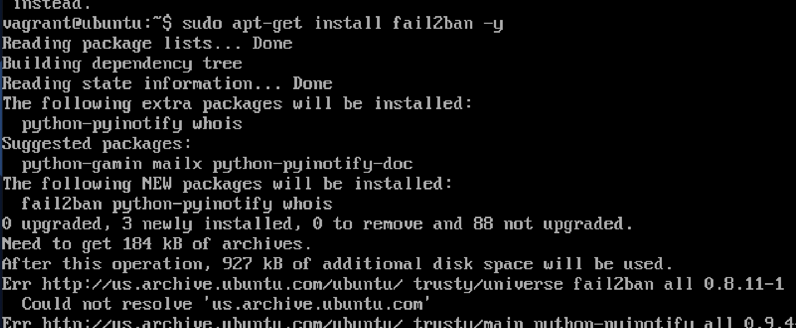
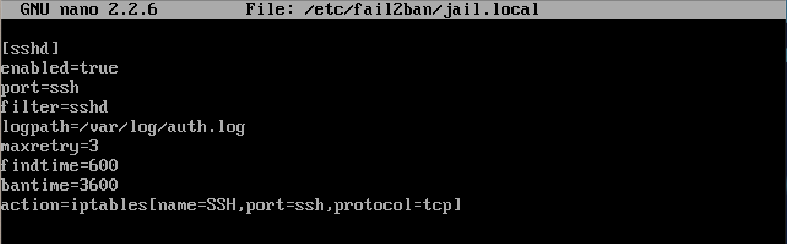
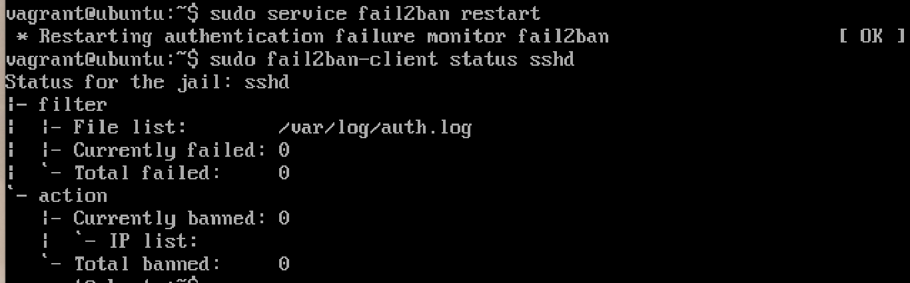

# Phase 3: Defensive Strategy with Fail2Ban
## 🎯 Objective

The objective of this phase is to propose, implement, and verify a defense mechanism to protect the victim machine (**Metasploitable3**) from brute-force attacks.  
We will use **Fail2Ban**, a tool that monitors logs for suspicious activity and automatically bans offending IP addresses.  

This phase includes:
- Configuring the defense
- Demonstrating the effectiveness before and after
- Showing proof through screenshots and logs
---

## ⚔️ Recap from Phase 1: The Attack

In **Phase 1**, we launched a successful brute-force SSH attack from our **attacker machine (Kali Linux)** against **Metasploitable3 (victim)**.  
The attack used a script with Hydra and weak credentials to access SSH.

---

## 🛡️ Pahse 3 Defense: Implement Security Tool - Using Fail2Ban

To defend against this type of attack, we implement **Fail2Ban** on the victim machine.  
This tool automatically bans an IP address after a number of failed SSH login attempts at specific time.

---

## 🏁 Step 1: Update and Install Fail2Ban

```bash
sudo apt update
sudo apt install fail2ban -y
```

---

## ⚙️ Step 2: Configure `jail.local` for SSH Protection

First, we create a local configuration file based on the default one:

```bash
sudo cp /etc/fail2ban/jail.conf /etc/fail2ban/jail.local
sudo nano /etc/fail2ban/jail.local
```

### and write the following:
<br>enabled: activates protection for SSH.</br>
<br>port: the SSH port to monitor.</br>
<br>filter: uses the sshd fail2ban filter rules.</br>
<br>logpath: log file to track failed logins.</br>
<br>maxretry: number of failed attempts before banning.</br>
<br>findtime: time window to count failures (in seconds).</br>
<br>bantime: duration of ban (in seconds).</br>
<br>action: firewall rule to block the attacker's IP (uses iptables).</br>
```[sshd]
enabled = true
port = ssh
filter = sshd
logpath = /var/log/auth.log
maxretry = 3
findtime = 600
bantime = 3600
action: iptables[name=SSH, port=ssh, protocol=tcp]
```

## 🔍 Step 4: Monitor Fail2Ban Status

Check if the SSH jail is active and working:

```
sudo fail2ban-client status sshd
```

## 🧪 Step 5: Attack Again (Test the Defense)
on the attack VM, run: 
```
./script.sh
```


